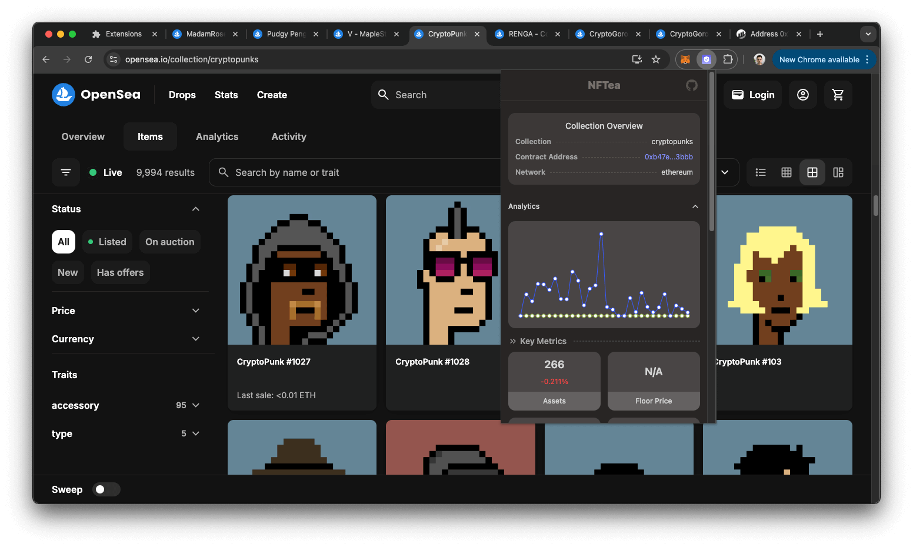

# NFTea 🫖

NFTea is a Chrome extension that brings powerful NFT analytics directly into your OpenSea browsing experience. Get instant access to detailed metrics, market insights, and trading data for NFT collections, assets, and wallets - all in a sleek, user-friendly interface.


Download from Chrome Store (Awaiting review)

## Features

### 🖼️ Collection Insights

-   Analytics with historical price and volume trends
-   Holder distribution and whale analysis
-   Comprehensive scoring metrics
-   Trading patterns and wash trade detection
-   Detailed holder profiles
-   Whale tracking

### 🏷️ Asset Details

-   Price analytics and historical data
-   Current holder information
-   Advanced scoring metrics
-   Trading history
-   Wash trade detection
-   Price estimates

### 👤 Wallet Analytics

-   Portfolio analytics
-   Performance scores
-   Trading patterns
-   Wash trade detection
-   Activity metrics

## Installation

1. Clone the repository

```bash
git clone https://github.com/almoloo/nftea-extension.git
cd nftea-extension
```

2. Install dependencies

```bash
npm install
```

3. Create a .env file in the root directory with your API keys:

```bash
VITE_OPENSEA_API_KEY=your_opensea_api_key
VITE_UNLEASHNFT_API_KEY=your_unleashnft_api_key
```

4. Build the extension

```bash
npm run build
```

5. Load the extension in Chrome:

-   Open Chrome and navigate to `chrome://extensions/`
-   Enable "Developer mode" in the top right
-   Click "Load unpacked" and select the `build` directory from the project

## Development

The project is built with:

-   React
-   TypeScript
-   Tailwind CSS
-   shadcn/ui components
-   OpenSea API
-   UnleashNFT API

## API Rate Limits

The UnleashNFT API has a rate limit of 20 requests per second. Please ensure your implementation respects this limit to maintain service quality.

## Contributing

Contributions are welcome! Feel free to submit issues and pull requests.

## License

This project is licensed under the MIT License - see the [LICENSE](LICENSE) file for details.

## Screenshots

#### Collection Overview



Real-time collection analytics with price trends and key metrics

#### Asset Details


Detailed asset information with price history and market metrics

#### Wallet Analysis


Comprehensive wallet analytics showing trading patterns and activity

## Privacy

NFTea only reads the current OpenSea pages url to provide analytics. No personal data is collected or stored.

## Support

For support, please open an issue on the GitHub repository or reach me at [amousavig@icloud.com](amousavig@icloud.com)

---

Built with ☕ and 🫖
